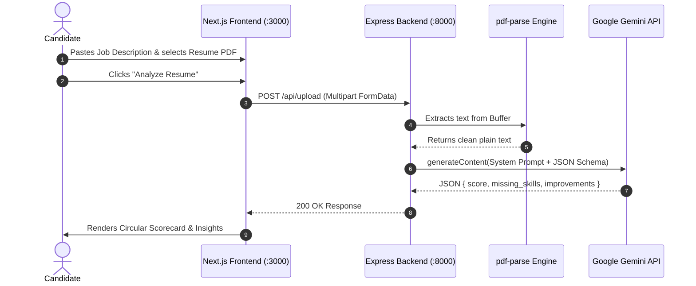

# AI Resume Analyzer 📄⚡

An intelligent, full-stack ATS Resume Evaluation engine that scans PDF resumes against targeted job descriptions to generate compatibility scores, missing technical skill gaps, and high-impact actionable improvements in real time.

---

## 🌟 Introduction

In modern hiring workflows, over 75% of resumes are filtered out by automated Applicant Tracking Systems (ATS) before reaching a human recruiter. Candidates frequently face high rejection rates due to missing domain keywords, poorly formatted credentials, or a lack of quantifiable impact metrics. Job seekers often struggle to pinpoint exactly why their profiles fail automated screening or how well their experience truly aligns with specific job requirements.

**AI Resume Analyzer** solves this problem by providing an intelligent, instant, and transparent evaluation pipeline. The application leverages a robust full-stack architecture consisting of a **Next.js** frontend with **Tailwind CSS**, an **Express.js** backend microservice, **pdf-parse** for server-side text extraction, and the **Google Gemini API** (`gemini-3.6-flash` / `gemini-1.5-flash`) for structured cognitive analysis. When a candidate uploads a PDF resume alongside a target job description, the Express backend extracts the raw document stream, injects the text into Gemini with strict JSON schema constraints, and returns a deterministic evaluation payload containing a match score (0–100), categorized missing technical skills, and tailored improvement recommendations.

---

## 🚀 Features

- **⚡ Instant PDF Parsing**: Fast server-side text extraction and buffer stream processing using `pdf-parse`.
- **🎯 Targeted Job Description Matching**: Evaluates resume content against specific role requirements, responsibilities, and qualifications.
- **📊 Dynamic Circular Progress Gauge**: Interactive SVG-based ATS score visualization with color-coded status tiers:
  - 🟢 **80–100**: *Strong Match* (High interview readiness)
  - 🟡 **60–79**: *Good Potential* (Minor gaps to polish)
  - 🔴 **0–59**: *Needs Attention* (Critical skill & keyword gaps)
- **🏷️ Missing Skills Detection**: Visual badge chips highlighting required technologies and frameworks absent from the candidate's resume.
- **💡 Actionable Improvement Cards**: Numbered, prioritized advice focusing on metric quantification, leadership emphasis, and keyword optimization.
- **🔒 Secure & Zero-Leak Design**: Complete `.env` git-ignore rules and strict schema validation preventing token wastage or API key exposure.

---

## 🛠️ Tech Stack

### **Frontend**
- **Framework**: [Next.js](https://nextjs.org/) (App Router, Turbopack)
- **UI & Styling**: [React](https://react.dev/), [Tailwind CSS](https://tailwindcss.com/)
- **Visuals**: Native SVG animated circular gauges & custom glassmorphic cards

### **Backend**
- **Runtime**: [Node.js](https://nodejs.org/) & [Express.js](https://expressjs.com/)
- **File Uploads**: [Multer](https://github.com/expressjs/multer) (In-memory buffer processing)
- **PDF Extraction**: [pdf-parse](https://www.npmjs.com/package/pdf-parse)
- **AI Engine**: [Google Generative AI SDK](https://www.npmjs.com/package/@google/generative-ai) (`gemini-3.6-flash` with strict JSON Schema output)
- **Security & Config**: [dotenv](https://www.npmjs.com/package/dotenv), [CORS](https://www.npmjs.com/package/cors)

---

## 🏗️ Architecture & Data Flow



---

## 💻 Local Setup Instructions

Follow these steps to run both the frontend and backend locally on your machine.

### Prerequisites
- **Node.js** (v18.0.0 or higher)
- **npm** or **yarn** / **pnpm**
- **Google Gemini API Key** (Free tier from [Google AI Studio](https://aistudio.google.com/app/apikey))

---

### 1. Clone the Repository
```bash
git clone https://github.com/<your-username>/<your-repo-name>.git
cd ai-resume-analyzer
```

---

### 2. Backend Setup

1. Open a terminal and navigate to the `backend` directory:
   ```bash
   cd backend
   ```
2. Install dependencies:
   ```bash
   npm install
   ```
3. Create a `.env` file in the `backend/` folder:
   ```env
   PORT=8000
   GEMINI_API_KEY=your_actual_gemini_api_key_here
   ```
4. Start the Express server:
   ```bash
   node server.js
   ```
   *The backend will start running on `http://localhost:8000`.*

---

### 3. Frontend Setup

1. Open a second terminal in the project root directory (`ai-resume-analyzer`):
   ```bash
   npm install
   ```
2. Run the Next.js development server:
   ```bash
   npm run dev
   ```
3. Open **[http://localhost:3000](http://localhost:3000)** in your browser.

---

## 📋 API Specification

### `POST /api/upload`
Accepts a multipart form containing the resume file and target job description.

#### **Request (Multipart Form-Data)**
- `file`: Resume file (`application/pdf`, max 10MB)
- `jobDescription`: String (Target role requirements / job posting text)

#### **Response (`application/json`)**
```json
{
  "score": 68,
  "missing_skills": [
    "Docker",
    "Kubernetes",
    "Redis"
  ],
  "improvements": [
    "Include metrics to quantify impact (e.g., increased revenue by 20%, reduced latency by 35ms)",
    "Highlight JWT and authentication architecture experience in backend roles"
  ]
}
```

---

## 🛡️ License
This project is open-source and available under the [MIT License](LICENSE).
